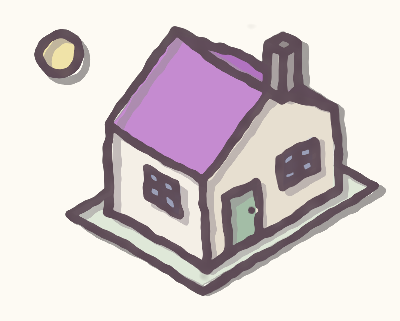

# sketch-style

Hand-drawn, sketchy rendering of ordinary SVG drawings, in the browser.

A plain SVG with crisp vector geometry goes in; what comes out looks like it
was inked with a brush pen — wobbly tapered strokes, fills that slide out from
under their outlines, soft gray cast-shadow strokes, and paper-like grain.

**Live app:** https://bahalafoundation.github.io/sketch-style/



## How it works

The effect is a GLSL post-process built on the *sketchy drawings* algorithm
from [GPU Gems 2, chapter 15][gpugems] (Nienhaus & Döllner, "Blueprint
Rendering and Sketchy Drawings"), adapted from 3D scenes to 2D vector art:

1. **Two maps instead of one.** The SVG is parsed with Three.js `SVGLoader`
   and rendered into two textures: strokes into an *edge map*, fills into a
   *shade map*. (The original paper extracts edges from depth/normal
   discontinuities; with vector art the strokes simply *are* the edges.)
2. **Uncertainty perturbation.** A Perlin-turbulence "uncertainty" field
   (`offs = turbulence(s, t)`, `offt = turbulence(1−s, 1−t)`, as in the
   chapter) displaces each map's texture coordinates — in *opposite
   directions*. Lines wander off the fills and fills bleed past the lines,
   which is the signature misregistration of a quick hand sketch.
3. **Repeated edges.** The edge map is sampled a second time with its own
   uncertainty, thinned, tinted gray and offset down-right, so every stroke
   carries a loose cast-shadow twin.
4. **Brush character.** On top of the paper's algorithm: fine-grain "frayed
   edge" noise, a small blur re-sharpened through an alpha ramp for soft
   wet-ink edges, and low-frequency pressure modulation that makes strokes
   swell, taper and occasionally break open.

Hidden-line removal falls out of SVG painter's order: each fill is also drawn
into the edge map as an eraser (`NoBlending`, writing transparent black), so
strokes covered by a later shape disappear exactly as they would in the flat
render.

## Using the app

- **Sliders** tune every shader parameter live — wobble, misregistration,
  ghost/shadow strokes, grain, ink, and brush pressure. *Save* persists the
  values in localStorage; *Copy JSON* exports them; *Reset* restores defaults.
- **Load SVG…** renders your own file, entirely client-side. Drawings whose
  shapes have both fills and strokes work best; the canvas adapts to the
  file's `viewBox`.
- The right-hand panel shows the same SVG untouched, for comparison.

## Development

```sh
npm install
npm run dev     # Vite dev server
npm run build   # emits dist/index.html — a self-contained single file
```

The build inlines Three.js, the shader and the default drawing into one HTML
file (via `vite-plugin-singlefile`), so `dist/index.html` runs from `file://`
with no server or network. Pushes to `main` deploy it to GitHub Pages via
`.github/workflows/deploy.yml`.

`svg-filter.html` is an earlier, dependency-free take on the same look using
pure SVG filters (`feTurbulence` + `feDisplacementMap`) — worth a look if you
want the effect without WebGL.

[gpugems]: https://developer.nvidia.com/gpugems/gpugems2/part-ii-shading-lighting-and-shadows/chapter-15-blueprint-rendering-and-sketchy
